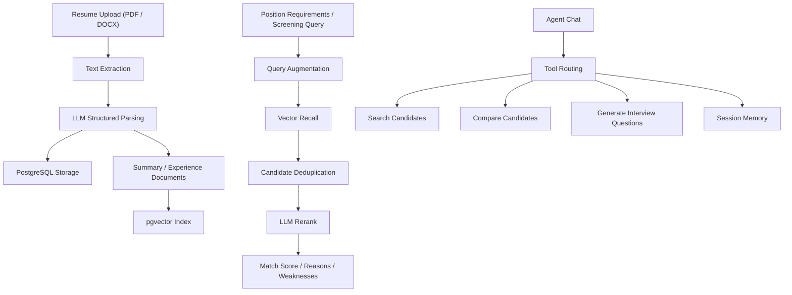

<div align="center">

# Resume Screening Agent

AI recruiting assistant for resume parsing, candidate screening, candidate comparison, and interview question generation.

[Live Demo](https://hx-code.xyz) · [Documentation](https://missrosery.github.io/resume-screening-agent/) · [中文文档](README.zh-CN.md)

</div>

## Overview

Resume Screening Agent is a full-stack recruiting workflow application built around a practical hiring loop:

1. upload resumes
2. extract and structure candidate data
3. retrieve and rerank candidates against a position or free-form query
4. compare shortlisted candidates
5. generate grouped interview questions
6. continue the workflow through lightweight agent-style interaction

The project focuses on explainable screening output rather than generic chat responses.

## Screenshots

### Position And Resume Management


### Screening Results, Comparison, And Interview Questions


### Agent Chat


## Architecture



## Features

### Resume Parsing

- Upload PDF and DOCX resumes
- Extract raw text and sanitize invalid control characters
- Parse structured candidate data with an LLM
- Store structured resume data and vector retrieval documents

Structured fields include:

- name
- phone
- email
- city
- job intention
- education
- highest degree
- work years
- work experience
- skills
- certifications
- summary

### Candidate Screening

- Query augmentation
- pgvector recall
- Candidate deduplication
- LLM reranking
- Explainable output with `match_score`, `match_reasons`, and `weaknesses`

### Candidate Comparison

- Compare two selected candidates
- Preserve real candidate names in comparison output
- Support follow-up references in agent chat

### Interview Question Generation

- Generate tailored interview questions from structured resume data
- Group questions by:
  - Technical Deep Dive
  - Project Review
  - Behavioral Assessment

### Agent Interaction

- Natural language search, comparison, and interview-question generation
- Lightweight session memory for recently referenced candidates
- Support references such as `the first candidate`, `the first two candidates`, and `candidate B`

## Tech Stack

### Frontend

- Next.js 14
- React 18
- TypeScript
- Tailwind CSS

### Backend

- FastAPI
- SQLAlchemy Async
- PostgreSQL
- pgvector

### AI / Retrieval

- DashScope / Qwen
- OpenAI-compatible client
- LangChain PGVector

## API Overview

### Positions

- `POST /positions`
- `GET /positions`
- `GET /positions/{id}`
- `DELETE /positions/{id}`

### Resumes

- `POST /positions/{position_id}/resumes/upload`
- `GET /positions/{position_id}/resumes`
- `GET /resumes/{resume_id}`
- `DELETE /resumes/{resume_id}`

### Screening

- `POST /positions/{position_id}/screen`
- `POST /resumes/compare`
- `POST /resumes/{resume_id}/interview-questions`

### Agent

- `POST /positions/{position_id}/sessions`
- `POST /sessions/{session_id}/chat`

## Project Structure

```text
backend/
  app/
    api/
    agents/
    core/
    infrastructure/
    models/
    rag/
    services/
  main.py

frontend/
  app/
  components/
  lib/

deploy/
docs/
```

## Local Development

### Option A: Local Environment

Backend:

```powershell
conda create -n resume-agent python=3.11 -y
conda activate resume-agent
cd E:\code\ai-agent-resume\backend
pip install -r requirements.txt
uvicorn main:app --reload
```

Frontend:

```powershell
cd E:\code\ai-agent-resume\frontend
npm install
npm run dev
```

### Option B: Docker Compose

```bash
docker compose up --build
```

## Environment

Use [backend/.env.example](backend/.env.example) as the template for local development.

Important variables:

- `DATABASE_URL`
- `SYNC_DATABASE_URL`
- `DASHSCOPE_API_KEY`
- `DASHSCOPE_BASE_URL`
- `LLM_MODEL`
- `EMBEDDING_MODEL`
- `UPLOAD_DIR`
- `CORS_ORIGINS`

Production deployment uses:

- [.env.production.example](.env.production.example)
- [backend/.env.production.example](backend/.env.production.example)
- [docker-compose.prod.yml](docker-compose.prod.yml)
- [DEPLOY.md](DEPLOY.md)

## Deployment

The live deployment uses:

- Docker Compose for `frontend`, `backend`, and `postgres`
- host Nginx for reverse proxy and HTTPS
- Certbot for Let's Encrypt certificates

See [DEPLOY.md](DEPLOY.md) for the production deployment flow.

## Security Notes

- Real API keys and production secrets are not included in this repository.
- Provider keys must remain server-side only.
- Exposed development credentials should be rotated immediately.
- Production CORS should be restricted to trusted origins.
