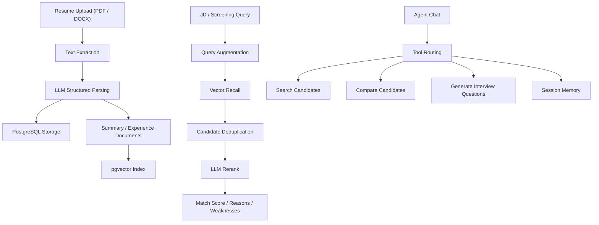

<div align="center">

# Resume Screening Agent

AI recruiting assistant for resume parsing, candidate screening, comparison, and interview question generation.

[中文文档](README.zh-CN.md)

</div>

## Overview

Resume Screening Agent is a full-stack AI recruiting assistant that combines:

- structured resume parsing
- vector retrieval and reranking
- candidate comparison
- grouped interview question generation
- lightweight agent-style interaction

It is designed around a practical hiring workflow: upload resumes, parse candidate profiles, screen against a JD, compare shortlisted candidates, and continue the process through natural language interactions.

## Screenshots

> Replace the placeholders below with actual screenshots. Suggested location: `docs/images/`.

### Position And Resume Management


### Screening Result


### Agent Chat


## Architecture



## Features

### Resume Parsing

- Upload PDF / DOCX resumes
- Extract text and normalize invalid characters
- Parse structured candidate data with an LLM
- Store structured fields and retrieval documents

Structured fields include:

- name
- phone / email
- city
- job intention
- education
- highest degree
- work years
- work experience
- skills
- certifications
- summary

### Candidate Screening

- Query augmentation
- pgvector recall
- Candidate deduplication
- LLM reranking
- Explainable output with:
  - `match_score`
  - `match_reasons`
  - `weaknesses`

### Candidate Comparison

- Compare two selected candidates
- Prefer real names in comparison output
- Support follow-up references in agent chat

### Interview Question Generation

- Generate tailored interview questions from structured resume data
- Group questions by:
  - Technical Deep Dive
  - Project Review
  - Behavioral Assessment

### Agent Interaction

- Natural language search / compare / question generation
- Lightweight session memory
- Support references such as:
  - the first candidate
  - the first two candidates
  - candidate B

## Tech Stack

### Frontend

- Next.js 14
- React 18
- TypeScript
- TailwindCSS

### Backend

- FastAPI
- SQLAlchemy Async
- PostgreSQL
- pgvector

### AI / Retrieval

- DashScope / Qwen
- OpenAI-compatible client
- LangChain PGVector

## Project Structure

```text
backend/
  app/
    api/
    agents/
    core/
    infrastructure/
    models/
    rag/
    services/
  main.py

frontend/
  app/
  components/
  lib/

docs/
  images/
```

## Local Development

### Option A: Local Environment

Backend:

```powershell
conda create -n resume-agent python=3.11 -y
conda activate resume-agent
cd E:\code\ai-agent-resume\backend
pip install -r requirements.txt
uvicorn main:app --reload
```

Frontend:

```powershell
cd E:\code\ai-agent-resume\frontend
npm install
npm run dev
```

### Option B: Docker Compose

```bash
docker compose up --build
```

## Environment

Use [backend/.env.example](backend/.env.example) as the template.

Important variables:

- `DATABASE_URL`
- `SYNC_DATABASE_URL`
- `DASHSCOPE_API_KEY`
- `DASHSCOPE_BASE_URL`
- `LLM_MODEL`
- `EMBEDDING_MODEL`
- `UPLOAD_DIR`
- `CORS_ORIGINS`

## API Keys And Self-Hosting

- This repository does not include any real API keys.
- When you run your own deployment, you must provide your own `DASHSCOPE_API_KEY`.
- If you self-host this project, all LLM and embedding usage is billed to your own provider account.
- Never commit `.env` files or production secrets to the repository.
- For a public demo, keep the API key on the server side only. Do not expose provider keys in frontend code.

## API Overview

### Positions

- `POST /positions`
- `GET /positions`
- `GET /positions/{id}`

### Resumes

- `POST /positions/{position_id}/resumes/upload`
- `GET /positions/{position_id}/resumes`
- `GET /resumes/{resume_id}`
- `DELETE /resumes/{resume_id}`

### Screening

- `POST /positions/{position_id}/screen`
- `POST /resumes/compare`
- `POST /resumes/{resume_id}/interview-questions`

### Agent

- `POST /positions/{position_id}/sessions`
- `POST /sessions/{session_id}/chat`

## Demo Flow

1. Create a position
2. Upload multiple resumes
3. Review structured parsing results
4. Run candidate screening from a JD or free-form query
5. Open candidate detail drawers
6. Compare candidates
7. Generate grouped interview questions
8. Continue through agent chat

## Current Capabilities

- Resume upload and structured parsing
- Candidate retrieval and reranking
- Candidate comparison
- Grouped interview question generation
- Agent chat with lightweight session memory
- Resume detail drawer
- Duplicate upload reuse
- Resume deletion with immediate UI update

## Roadmap

- Better logging and error classification
- Minimal automated tests
- Deployment guide
- More robust agent context control
- Real screenshots / GIFs / demo video

## Security Notes

- Do not commit real API keys or database passwords
- Rotate any exposed key during development
- Replace development credentials before deployment
- Restrict CORS in production
