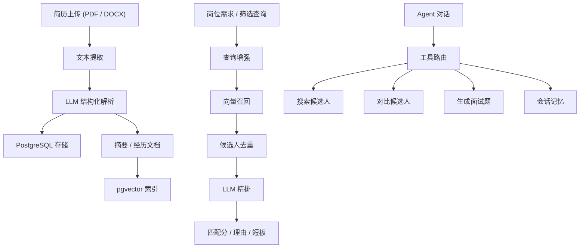

<div align="center">

# Resume Screening Agent

一个用于简历解析、候选人筛选、候选人对比和面试题生成的 AI 招聘助手。

[English](README.md)

</div>

## 项目简介

Resume Screening Agent 是一个面向招聘流程的全栈 AI 应用，围绕以下核心能力构建：

- 简历结构化解析
- 向量检索与精排
- 候选人对比
- 分组面试题生成
- 轻量 Agent 式自然语言交互

它覆盖了一条完整的招聘辅助链路：上传简历、解析候选人信息、基于岗位需求筛选候选人、对比候选人、生成面试题，并支持通过自然语言继续操作。

## 功能截图

> 当前为占位路径，后续可替换为真实截图。建议统一放在 `docs/images/` 目录下。

### 岗位与简历管理


### 候选人筛选结果


### Agent 对话


## 架构图



## 主要功能

### 简历解析

- 支持 PDF / DOCX 简历上传
- 自动提取简历文本并清洗异常字符
- 使用 LLM 输出结构化候选人信息
- 保存结构化字段和检索文档

结构化字段包括：

- 姓名
- 电话 / 邮箱
- 城市
- 求职意向
- 教育经历
- 最高学历
- 工作年限
- 工作经历
- 技能
- 证书
- 摘要

### 候选人筛选

- 查询增强
- pgvector 向量召回
- 候选人去重
- LLM 精排
- 输出可解释结果：
  - `match_score`
  - `match_reasons`
  - `weaknesses`

### 候选人对比

- 支持直接选择两位候选人进行对比
- 支持在 Agent 对话中通过自然语言发起对比
- 优先输出真实候选人姓名

### 面试题生成

- 基于结构化简历生成定制化面试题
- 按以下维度分组：
  - 技术深挖
  - 项目复盘
  - 行为判断

### Agent 交互

- 支持自然语言搜索、对比、出题
- 支持轻量会话记忆
- 支持类似以下引用方式：
  - 前两个候选人
  - 第一个候选人
  - 候选人 B

## 技术栈

### Frontend

- Next.js 14
- React 18
- TypeScript
- TailwindCSS

### Backend

- FastAPI
- SQLAlchemy Async
- PostgreSQL
- pgvector

### AI / Retrieval

- DashScope / Qwen
- OpenAI-compatible client
- LangChain PGVector

## 项目结构

```text
backend/
  app/
    api/
    agents/
    core/
    infrastructure/
    models/
    rag/
    services/
  main.py

frontend/
  app/
  components/
  lib/

docs/
  images/
```

## 本地开发

### 方式一：本地环境

后端：

```powershell
conda create -n resume-agent python=3.11 -y
conda activate resume-agent
cd E:\code\ai-agent-resume\backend
pip install -r requirements.txt
uvicorn main:app --reload
```

前端：

```powershell
cd E:\code\ai-agent-resume\frontend
npm install
npm run dev
```

### 方式二：Docker Compose

```bash
docker compose up --build
```

## 环境变量

参考 [backend/.env.example](backend/.env.example)。

关键变量：

- `DATABASE_URL`
- `SYNC_DATABASE_URL`
- `DASHSCOPE_API_KEY`
- `DASHSCOPE_BASE_URL`
- `LLM_MODEL`
- `EMBEDDING_MODEL`
- `UPLOAD_DIR`
- `CORS_ORIGINS`

## API Key 与自部署说明

- 仓库中不包含任何真实 API Key。
- 任何人自行部署本项目时，都需要在自己的环境变量中提供自己的 `DASHSCOPE_API_KEY`。
- 如果你自己部署并开放访问，产生的 LLM 与 embedding 调用费用由你自己的服务账号承担。
- 不要把 `.env` 文件或生产密钥提交到仓库。
- 如果做公开 demo，API Key 必须只保存在服务端，不能暴露在前端代码中。

## API 概览

### Positions

- `POST /positions`
- `GET /positions`
- `GET /positions/{id}`

### Resumes

- `POST /positions/{position_id}/resumes/upload`
- `GET /positions/{position_id}/resumes`
- `GET /resumes/{resume_id}`
- `DELETE /resumes/{resume_id}`

### Screening

- `POST /positions/{position_id}/screen`
- `POST /resumes/compare`
- `POST /resumes/{resume_id}/interview-questions`

### Agent

- `POST /positions/{position_id}/sessions`
- `POST /sessions/{session_id}/chat`

## 演示流程建议

1. 创建岗位
2. 上传多份简历
3. 查看结构化解析结果
4. 输入岗位需求，得到候选人筛选结果
5. 打开候选人详情抽屉
6. 对比两位候选人
7. 生成分组面试题
8. 进入 Agent 页面继续自然语言交互

## 当前能力

- 简历上传与结构化解析
- 候选人检索与精排
- 候选人对比
- 分组面试题生成
- Agent 对话与轻量会话记忆
- 候选人详情抽屉
- 重复简历复用
- 简历删除与前端即时更新

## 后续计划

- 更完整的日志与错误分层
- 最小自动化测试集
- 部署说明
- 更稳的 Agent 上下文控制
- 真实截图 / GIF / 演示视频

## 安全说明

- 不要提交真实 API Key 或数据库密码
- 若开发阶段泄露过密钥，务必立即轮换
- 部署前请替换开发环境默认凭证
- 生产环境应收紧 CORS 配置
