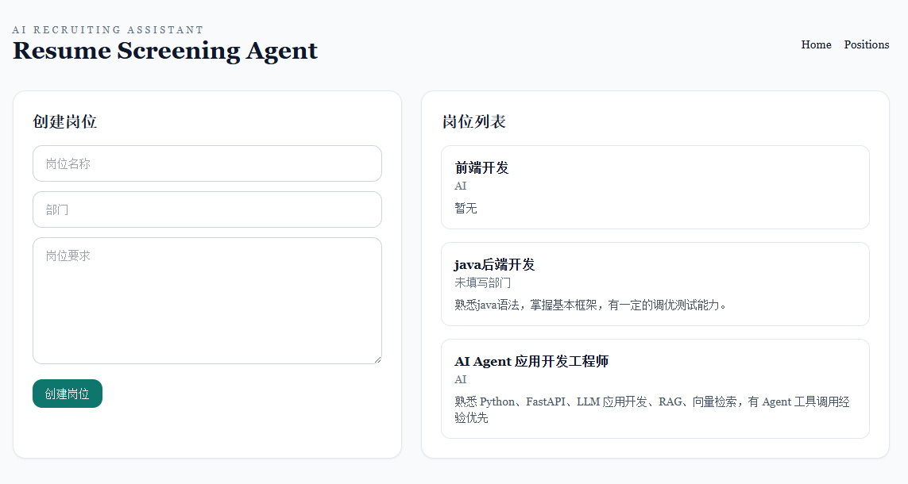
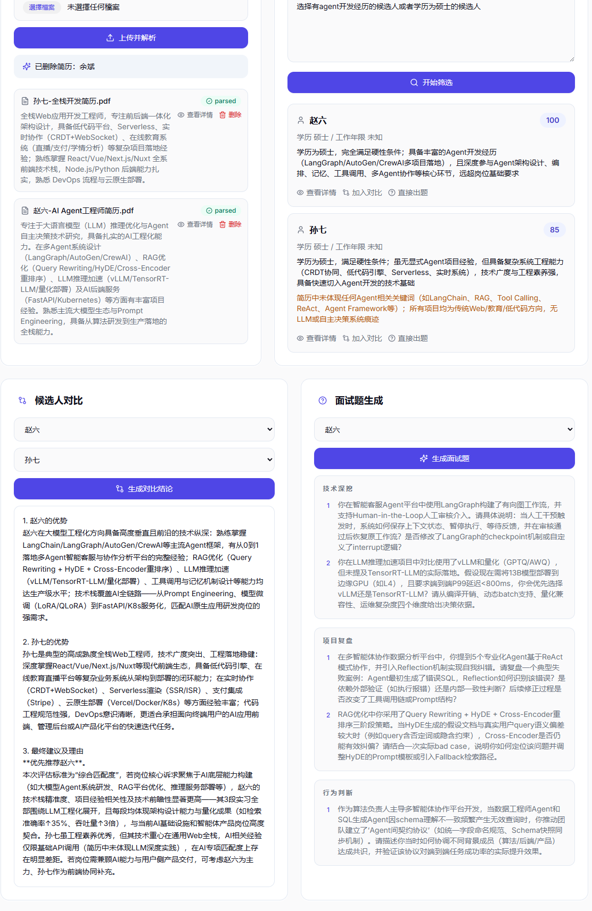
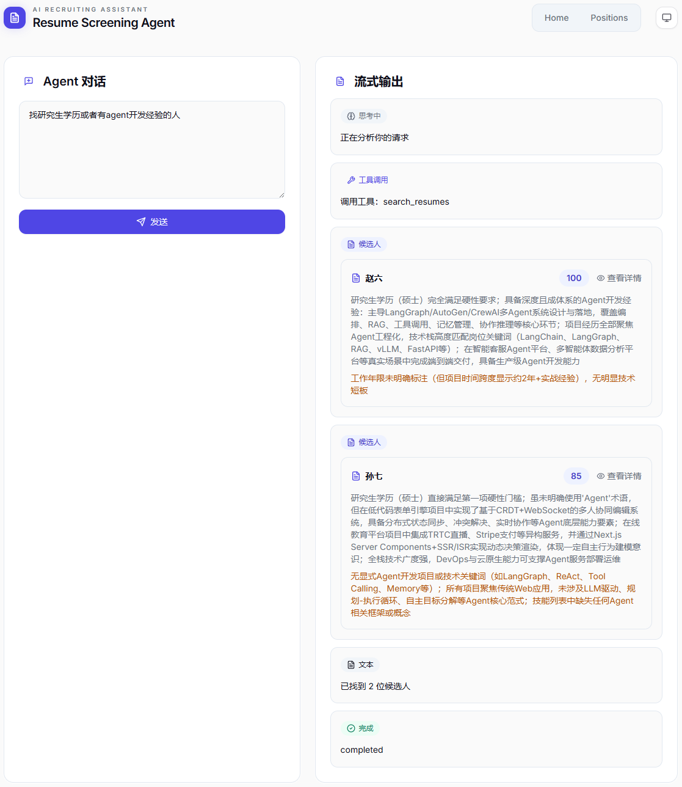
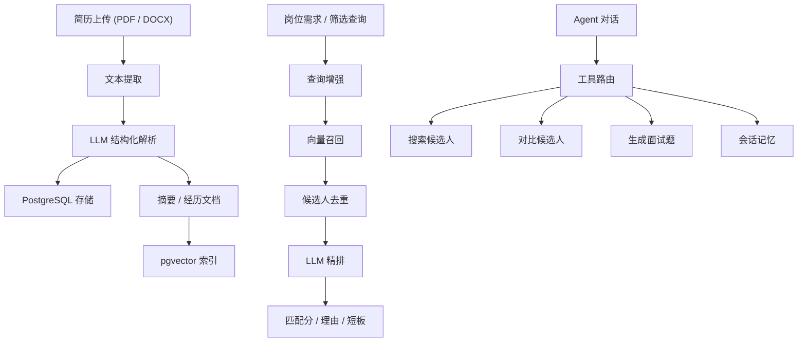

<div align="center">

# Resume Screening Agent

一个用于简历解析、候选人筛选、候选人对比和面试题生成的 AI 招聘助手。

[Live Demo](https://hx-code.xyz) · [在线文档](https://missrosery.github.io/resume-screening-agent/) · [English](README.md)

</div>

## 项目简介

Resume Screening Agent 是一个面向招聘流程的全栈 AI 应用，围绕一条完整的招聘辅助链路构建：

1. 上传简历
2. 提取并结构化候选人信息
3. 基于岗位需求或自然语言查询召回并精排候选人
4. 对比候选人
5. 生成分组面试题
6. 通过轻量 Agent 交互继续推进筛选流程

项目重点放在“可解释的候选人筛选输出”，而不是通用聊天式回答。

## 功能截图

### 岗位与简历管理



### 候选人筛选、对比与面试题生成



### Agent 对话



## 架构图



## 主要功能

### 简历解析

- 支持 PDF 和 DOCX 简历上传
- 自动提取原始文本并清洗异常控制字符
- 使用 LLM 输出结构化候选人信息
- 保存结构化字段和向量检索文档

结构化字段包括：

- 姓名
- 电话
- 邮箱
- 城市
- 求职意向
- 教育经历
- 最高学历
- 工作年限
- 工作经历
- 技能
- 证书
- 摘要

### 候选人筛选

- 查询增强
- pgvector 向量召回
- 候选人去重
- LLM 精排
- 输出可解释结果：`match_score`、`match_reasons`、`weaknesses`

### 候选人对比

- 支持直接选择两位候选人进行对比
- 对比结果优先保留真实候选人姓名
- 支持在 Agent 对话中继续引用候选人

### 面试题生成

- 基于结构化简历生成定制化面试题
- 按以下维度分组：
  - 技术深挖
  - 项目复盘
  - 行为判断

### Agent 交互

- 支持自然语言搜索、对比和出题
- 支持轻量会话记忆
- 支持类似 `前两个候选人`、`第一个候选人`、`候选人 B` 这类引用方式

## 技术栈

### Frontend

- Next.js 14
- React 18
- TypeScript
- Tailwind CSS

### Backend

- FastAPI
- SQLAlchemy Async
- PostgreSQL
- pgvector

### AI / Retrieval

- DashScope / Qwen
- OpenAI-compatible client
- LangChain PGVector

## API 概览

### Positions

- `POST /positions`
- `GET /positions`
- `GET /positions/{id}`
- `DELETE /positions/{id}`

### Resumes

- `POST /positions/{position_id}/resumes/upload`
- `GET /positions/{position_id}/resumes`
- `GET /resumes/{resume_id}`
- `DELETE /resumes/{resume_id}`

### Screening

- `POST /positions/{position_id}/screen`
- `POST /resumes/compare`
- `POST /resumes/{resume_id}/interview-questions`

### Agent

- `POST /positions/{position_id}/sessions`
- `POST /sessions/{session_id}/chat`

## 项目结构

```text
backend/
  app/
    api/
    agents/
    core/
    infrastructure/
    models/
    rag/
    services/
  main.py

frontend/
  app/
  components/
  lib/

deploy/
docs/
```

## 本地开发

### 方式一：本地环境

后端：

```powershell
conda create -n resume-agent python=3.11 -y
conda activate resume-agent
cd E:\code\ai-agent-resume\backend
pip install -r requirements.txt
uvicorn main:app --reload
```

前端：

```powershell
cd E:\code\ai-agent-resume\frontend
npm install
npm run dev
```

### 后端测试

```powershell
cd E:\code\ai-agent-resume\backend
pip install -r requirements-dev.txt
pytest
```

当前测试覆盖请求参数校验、上传异常处理、简历文本清洗、向量文档构造、LLM 对比失败降级和统一错误响应。

### 方式二：Docker Compose

```bash
docker compose up --build
```

## 环境变量

本地开发可参考 [backend/.env.example](backend/.env.example)。

关键变量：

- `DATABASE_URL`
- `SYNC_DATABASE_URL`
- `DASHSCOPE_API_KEY`
- `DASHSCOPE_BASE_URL`
- `LLM_MODEL`
- `EMBEDDING_MODEL`
- `UPLOAD_DIR`
- `MAX_UPLOAD_FILE_SIZE`
- `CORS_ORIGINS`

生产部署相关文件：

- [.env.production.example](.env.production.example)
- [backend/.env.production.example](backend/.env.production.example)
- [docker-compose.prod.yml](docker-compose.prod.yml)
- [DEPLOY.md](DEPLOY.md)

## 部署说明

线上部署使用以下结构：

- Docker Compose 运行 `frontend`、`backend`、`postgres`
- 宿主机 Nginx 负责反向代理和 HTTPS
- Certbot 负责 Let's Encrypt 证书签发与续期

生产部署流程见 [DEPLOY.md](DEPLOY.md)。

## 安全说明

- 仓库中不包含任何真实 API Key 或生产密钥。
- Provider Key 只能保存在服务端，不能暴露在前端。
- 开发阶段若泄露过凭据，应立即轮换。
- 生产环境应将 CORS 收紧到可信来源。
